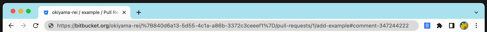

# bitbucket-canonical-url

Browser extension that canonize Bitbucket URLs.



## Description

Bitbucket URLs in a location bar sometimes looks ugly:

```
https://bitbucket.org/foo/%7B840d6a13-5d55-4c1a-a86b-3372c3ceeef1%7D/pull-requests/123/branch-name#comment-123456789
```

This extension canonizes the URL when the icon is clicked.

```
https://bitbucket.org/foo/bar/pull-requests/123#comment-123456789
```

## Development

```sh
# run in development mode
npm run dev

# build
npm run build

# prettier
npm run prettier

# test
npm run test
npm run coverage
```
